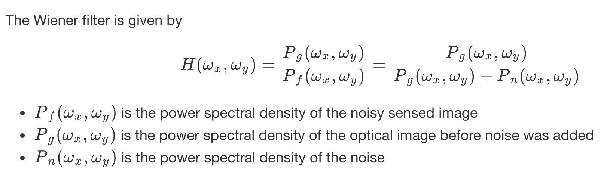
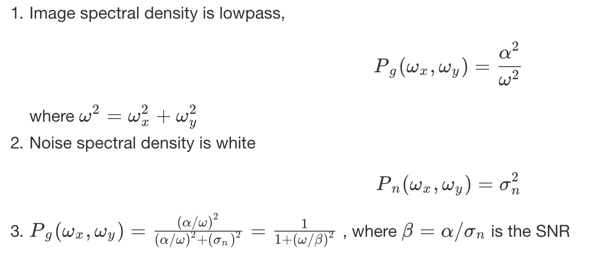
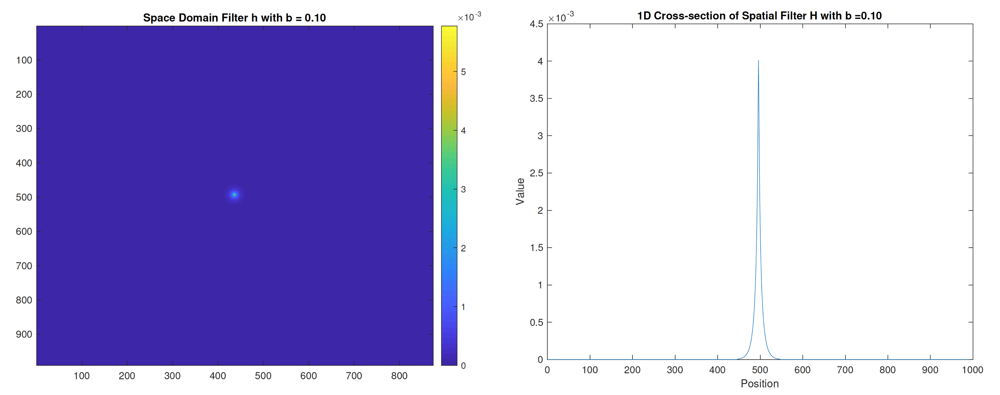
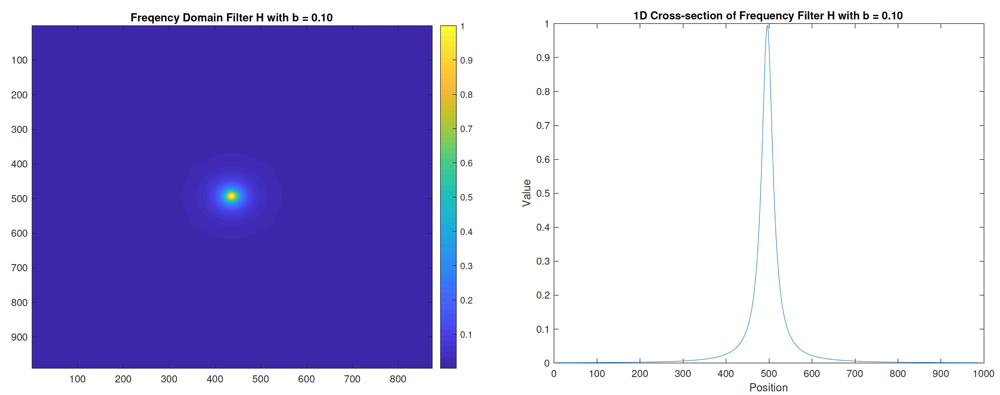
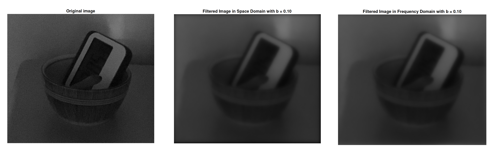
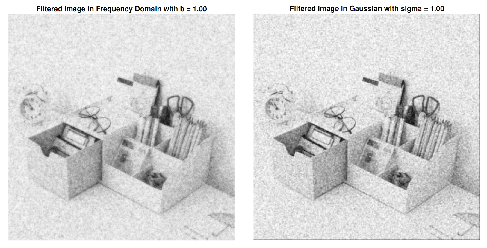
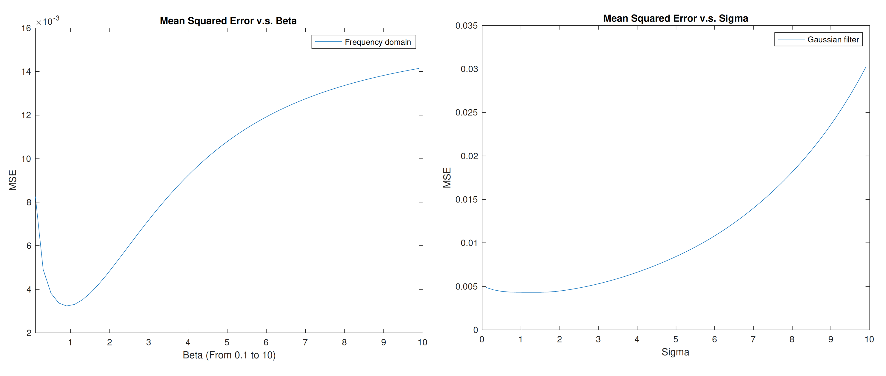
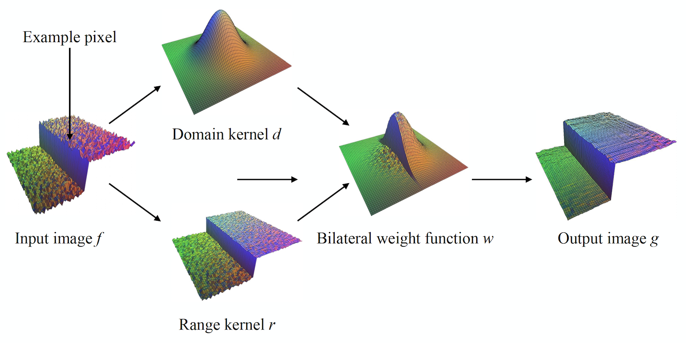
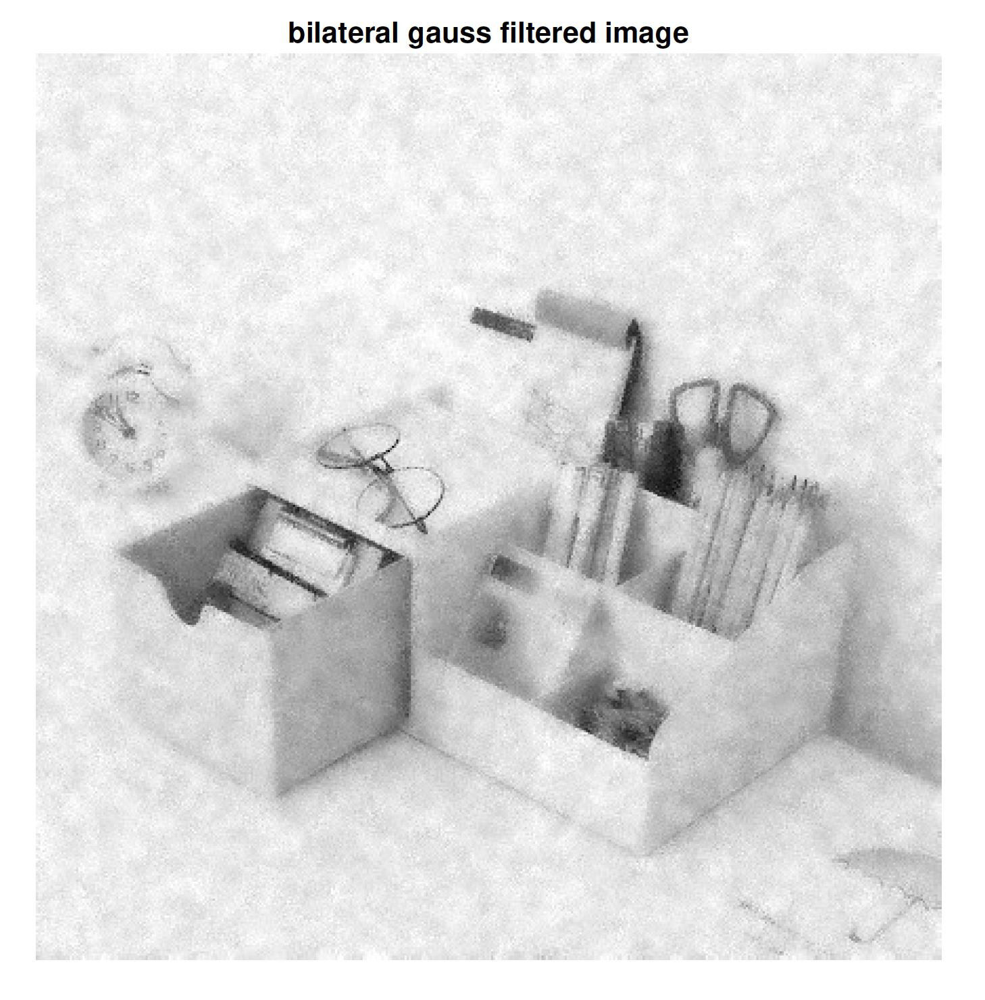

# Filters
- `Q1` generates results of applying *Wiener filter* in both frequency domain and spatial domain for the given image under low light condition and beta value. 
- `Q2Q3` compares *Wiener filter* and *Gaussian filter* for noisy image, calculates the MSE and use MATLAB build-in Bilateral filter to minimize the MSE. 

## Wiener Filter in Spatial and Frequency Domain
When the frequency distribution of the image energy and the noise energy differ, we can improve the signal-to-noise ratio (SNR) by boosting the Fourier amplitudes where the image is strong relative to the noise and attenuating the Fourier amplitudes where it is relatively weak.

#### Why Winer Filter?
- The Wiener filter minimizes the expected mean square error (MSE) of the estimated image relative to the original image before noise was added.
- It is the optimal linear shift-invariant solution to this problem
- Note that this optimality is general - it does not depend upon either the noise or the image being Gaussian.

#### Wiener Filter Example
`freqdomain.m` constructs Wiener filter in frequency domain with Fourier transform through following steps. 
`spacedomain.m` get the inverse Hankel transform of H by taking the inverse Fourier transform

Assume isotropic spectral densities for both image and noise

## Winer and Gaussian Filter
Create a noisy version of input image, then use *Wiener filter* and *Gaussian filter* for denoising

Plot the MSE(Mean Squared Error) to find the optimal value that minimizes MES

# Bilateral filter
- *Gaussian linear* filters provide a nice way of grading the weights of neighbouring pixels so that closer pixels have more influence than more distant pixels.
- *Median filters* provide a nice way of reducing the influence of outlier values.

*Bilateral filter* is the comibnation of domain kernel(Gaussian) and range kernel(Median). 

Result of using bilatreal filter: 

  
