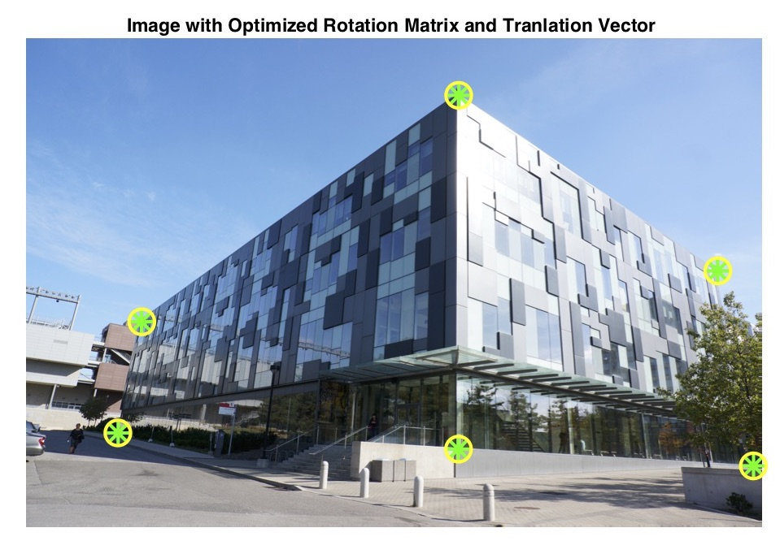

# Geometric Camera Calibration

1. Use checkerboard image and the MATLAB camera calibrator app to geometrically calibrate the camera. 
   - `cameraParams` contains the output files of the MATLAB camera calibrator app.
   - `checkerboard` contains the input images of the MATLAB camera calibrator app taken with iPhone Xs.
2. Given dimensions of York's LASB building and an image of that building taken with a Sony NEX-6 camera, which automatically corrects for radial distortions. Assume square pixels and zero skew
   - Use information to determine the extrinsic parameters (3D rotation and translation) of the camera.
   - Estimate the uncertainty in these parameters by bootstraping. 

###### Image Input: 
  
###### Image Output: 
  

