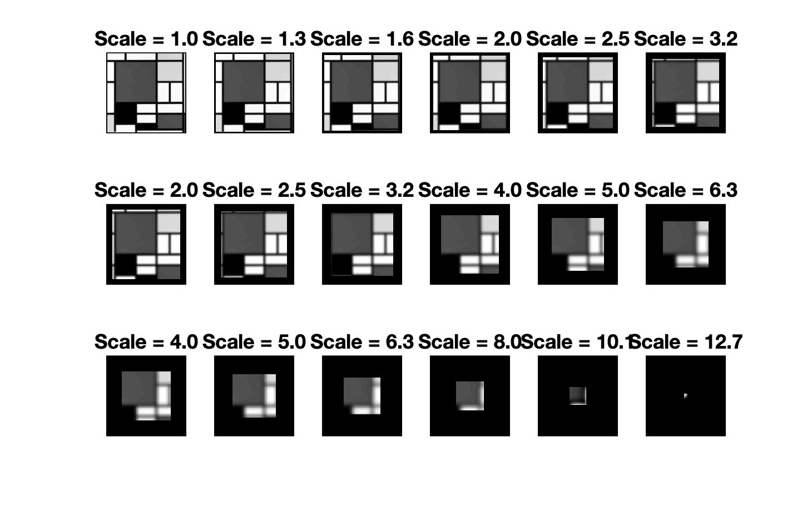
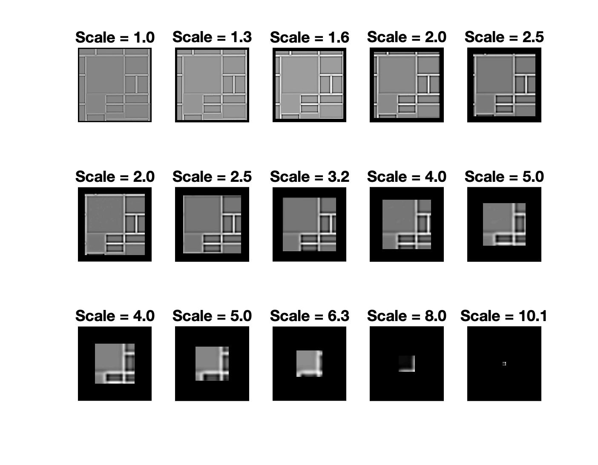
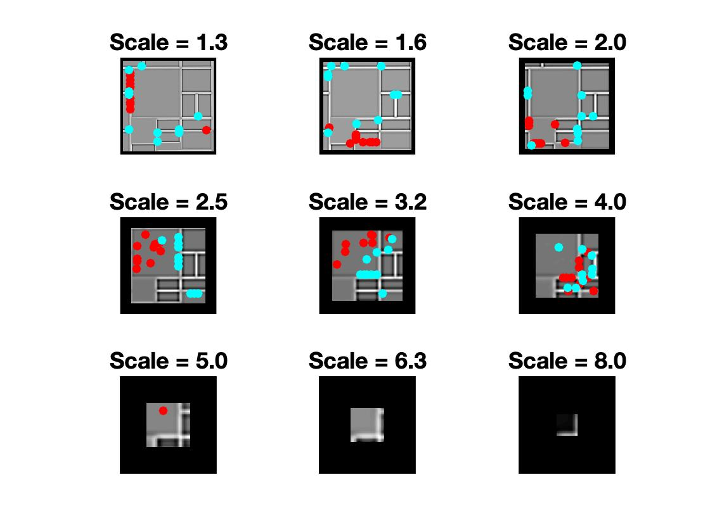

# Scale Invariant Feature Transform (SIFT)

The front-end implementation of David Lowe's [Scale Invariant Feature Transform (SIFT)](https://people.eecs.berkeley.edu/~malik/cs294/lowe-ijcv04.pdf) feature detector. 

*---Original test image:*

## Gaussian Scale Space
`GSS.m` creates a Gaussian pyramid representation of a greyscale image. 

`GPyr = GSS(im, s1, ns, noctaves)`
- **im** is the input greyscale image.
- **s1** is the space constant of the Gaussian kernel applied to the rst (base) level of each octave of the pyramid. Lowe uses s1 = 1.6 pixels.
- **ns** is the number of subbands per octave. Lowe uses ns = 3.
- **noctaves** is the number of octaves to represent. Note that each octave is down-sampled by a factor of 2 in both x and y.
- **GPyr** is a MATLAB cell array containing the Gaussian pyramid. Each element of the array is itself a 3D array containing ns + 3 sub-octave images. This allows
computation of ns + 2 DoG images, and thus detection of DoG extrema at ns subband scales.

*---Output:* 

## Difference of Gaussian Scale Space
`DoGSS.m` uses GSS to create a Difference of Gaussian pyramid representation of an image.

`DoGPyr = DoGSS(GPyr)`
- **GPyr** is a Gaussian pyramid (see above).
- **DoGPyr** is a MATLAB cell array of length noctaves containing the Difference of Gaussian pyramid. Each element of the array is a 3D array containing ns + 2 sub-octave DoG images. This will allow detection of ns extrema of DoG features over scale.

*---Output:* 

## Keypoint Detection
`SSExtrema.m` finds all of the keypoints (scalespace extrema) in a Difference of Gaussian pyramid.

`kp = SSExtrema(DoGPyr)`
- **DoGPyr** is a Difference of Gaussian pyramid (see above)
- **kp** is a MATLAB cell array of length noctaves containing the detected keypoints. Each element is itself a cell array over the ns subband scales. Each element of this cell array consists of two elds max and min, each of which is an n x 3 array containing (x, y, val): the coordinates and values of the local maxima and minima within the subband.

*---Output:* 
